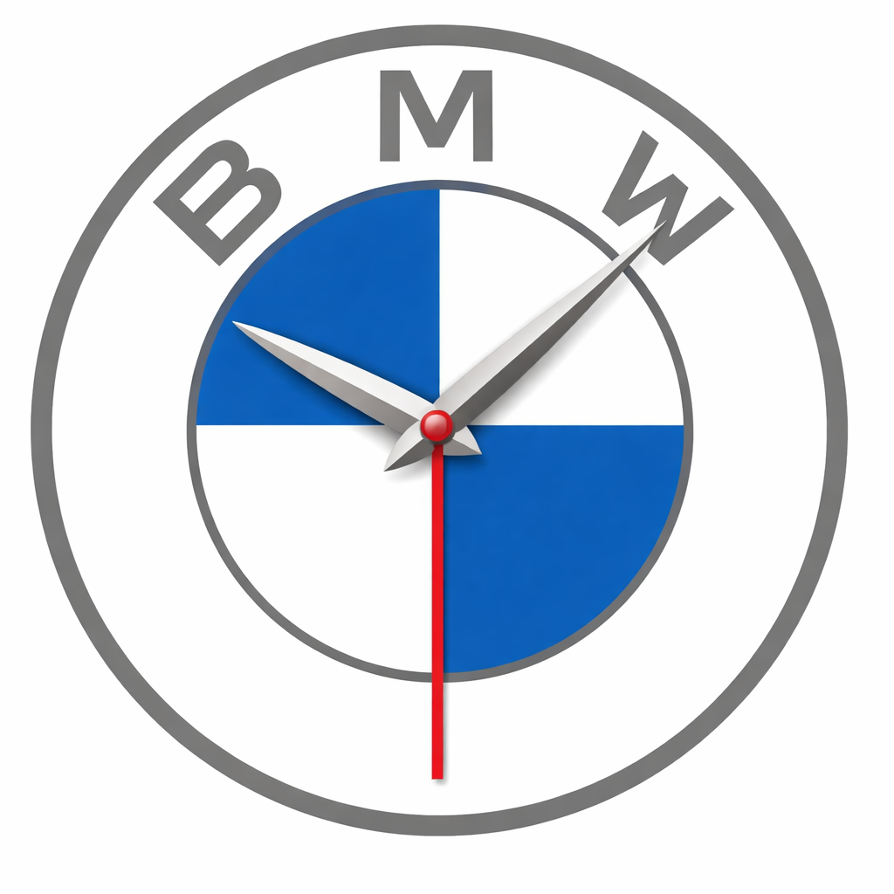
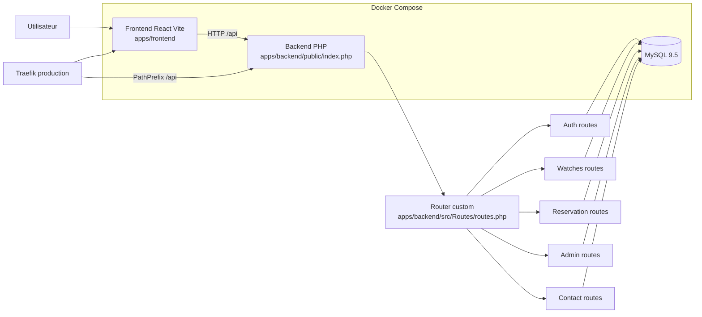

<div align="center">

# Belle Montre Wallone

Plateforme e-commerce de montres avec frontend React, API PHP native, MySQL et deploiement Docker.



[](https://github.com/xen0r-star/BelleMontreWallone/actions/workflows/deploy.yml)
[](https://github.com/xen0r-star/BelleMontreWallone/actions/workflows/deploy.yml)
[](LICENSE)


</div>

## Table des matieres

- [Presentation](#presentation)
- [Architecture](#architecture)
- [CI/CD](#cicd)
- [Lancer le projet en local](#lancer-le-projet-en-local)
- [Endpoints API](#endpoints-api)
- [Contributeurs](#contributeurs)
- [Licence](#licence)

## Presentation

Belle Montre Wallone est un monorepo npm structure en workspaces:

- frontend SPA React + Vite dans apps/frontend
- backend API REST PHP native dans apps/backend
- base MySQL initialisee automatiquement via scripts SQL
- orchestration Docker Compose, avec routage de production via Traefik

Le site est publie en production sur: https://www.bellemontrewallone.store

## Architecture



## CI/CD

Le workflow GitHub Actions est defini dans .github/workflows/deploy.yml.

Il couvre:

- detection des changements frontend/backend
- verification frontend (installation et build)
- verification backend (lint PHP, validation, test Docker Compose)
- deploiement backend sur OVH
- deploiement frontend sur OVH
- resume final des jobs

Declenchement:

- push sur main
- pull_request vers main

## Lancer le projet en local

### 1. Cloner le repository

```bash
git clone https://github.com/xen0r-star/BelleMontreWallone.git
cd BelleMontreWallone
```

### 2. Installer les dependances frontend

```bash
npm install
```

### 3. Lancer backend + base de donnees (compose local)

```bash
cd apps/backend
docker compose up -d
cd ../..
```

### 4. Lancer le frontend en developpement

```bash
npm run frontend:dev
```

Frontend local: http://localhost:5173

Backend local: http://localhost:8080/api

PhpMyAdmin local: http://localhost:8081

## Endpoints API

Base API de production: https://www.bellemontrewallone.store/api

| Methode | Endpoint            | Protection                     | Description                  |
| ------- | ------------------- | ------------------------------ | ---------------------------- |
| GET     | /health             | Aucune                         | Etat de sante API            |
| GET     | /watches            | Aucune                         | Liste paginee des montres    |
| GET     | /watches/filter     | Aucune                         | Valeurs de filtres catalogue |
| GET     | /watches/:id        | Aucune                         | Detail montre                |
| POST    | /auth/register      | Aucune                         | Inscription utilisateur      |
| POST    | /auth/login         | Aucune                         | Connexion utilisateur        |
| POST    | /auth/logout        | Session (cookie refresh_token) | Deconnexion utilisateur      |
| POST    | /auth/refresh       | Refresh token (body JSON)      | Renouvellement de session    |
| GET     | /auth/me            | Auth (cookie access_token)     | Utilisateur courant          |
| POST    | /reservations       | Auth (cookie access_token)     | Creation reservation         |
| POST    | /contact            | Aucune                         | Envoi formulaire de contact  |
| POST    | /admin/watches      | Admin                          | Creation montre              |
| PUT     | /admin/watches/:id  | Admin                          | Mise a jour montre           |
| DELETE  | /admin/watches/:id  | Admin                          | Desactivation montre         |
| GET     | /admin/reservations | Admin                          | Liste reservations           |

## Contributeurs

Usernames GitHub detectes dans les commits du repo:

- xen0r-star
- TomusLeVrai
- Coco-Lapin
- Bapum755

## Licence

Projet sous licence MIT. Voir LICENSE.