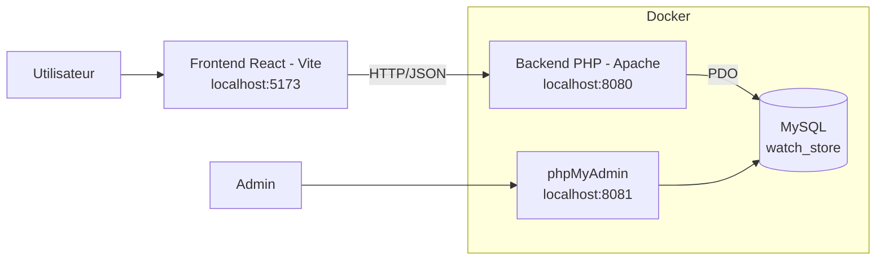

# ProjetTI - Application web de gestion de montres

Projet académique réalisé dans le cadre du cours de technologies mobiles.

## Table des matières

- [Langages et technologies](#langages-et-technologies)
- [Auteurs](#auteurs)
- [Objectifs du projet](#objectifs-du-projet)
- [Fonctionnalités principales](#fonctionnalites-principales)
- [Stack technique](#stack-technique)
- [Architecture globale (Mermaid)](#architecture-globale-mermaid)
- [Structure du repository](#structure-du-repository)
- [Prérequis](#prerequis)
- [Installation et démarrage](#installation-et-demarrage)
- [Scripts disponibles](#scripts-disponibles)
- [Configuration](#configuration)
- [Base de données](#base-de-donnees)
- [Captures d'écran de l'application](#captures-decran-de-lapplication)
- [Contribution](#contribution)
- [Licence](#licence)

## Langages et technologies


## Auteurs

- xen0r-star
- TomusLeVrai
- Tigrouuuu
- pingu

## Objectifs du projet

ProjetTI vise à proposer une application web complète autour d'un catalogue de montres:

- consultation des produits côté client;
- gestion des réservations et des contacts;
- espace d'administration pour les opérations back-office;
- architecture full-stack moderne avec séparation frontend/backend.

## Fonctionnalités principales

- Frontend React avec navigation multi-pages (React Router).
- API backend PHP pour l'authentification et les opérations métiers.
- Gestion des données via MySQL.
- Outils d'administration de la base via phpMyAdmin.

## Stack technique

- Backend: PHP 8.2, Apache, PDO MySQL
- Frontend: React 18, React Router, Vite
- Base de données: MySQL
- Conteneurisation: Docker Compose

## Architecture globale (Mermaid)



## Structure du repository

```text
.
|- docker-compose.yml
|- package.json
|- README.md
|- LICENSE
|- config/
|  |- php.ini
|- apps/
|  |- backend/
|  |  |- Dockerfile
|  |  |- public/
|  |  |- src/
|  |  |  |- Config/
|  |  |  |- Core/
|  |  |  |- Routes/
|  |  |  |- Utils/
|  |  |- database/
|  |- frontend/
|     |- package.json
|     |- src/
|     |  |- components/
|     |  |- pages/
|     |  |- services/
|     |- public/
|- docs/
	 |- screenshots/
```

## Prerequis

- Docker et Docker Compose
- Node.js 18+ et npm

## Installation et demarrage

### 1. Cloner le repository

```bash
git clone <url-du-repo>
cd ProjetTI
```

### 2. Installer les dependances frontend

```bash
npm install
```

### 3. Lancer la stack Docker (backend + db + phpMyAdmin)

```bash
docker compose up -d --build
```

### 4. Lancer le frontend en developpement

```bash
npm run frontend:dev
```

## Acces aux services

- Frontend: http://localhost:5173
- API backend: http://localhost:8080
- phpMyAdmin: http://localhost:8081

## Scripts disponibles

Depuis la racine du projet:

- `npm run frontend:dev`: démarre le frontend en mode développement
- `npm run frontend:build`: génère le build de production
- `npm run frontend:preview`: prévisualise le build de production

## Configuration

Le fichier `docker-compose.yml` définit des variables d'environnement par défaut, notamment:

- `APP_ENV`
- `DB_HOST`, `DB_PORT`, `DB_NAME`, `DB_USER`, `DB_PASSWORD`
- `ADMIN_USER`, `ADMIN_PASSWORD`, `ADMIN_API_KEY`
- `JWT_SECRET`
- `CORS_ALLOWED_ORIGINS`

Pour un usage en production:

- remplacez toutes les valeurs sensibles;
- évitez de conserver des identifiants en clair;
- privilégiez des secrets injectés via variables d'environnement sécurisées.

## Base de donnees

Les scripts SQL sont disponibles dans `apps/backend/database`:

- `DBTable.sql`: création des tables
- `DBInsert.sql`: insertion des données initiales

Si les tables ne sont pas créées automatiquement au démarrage des conteneurs, importez ces scripts manuellement via phpMyAdmin.

## Captures d'ecran de l'application

Un espace est prévu pour les captures dans `docs/screenshots`.

Exemples recommandés:

- page d'accueil
- page collection
- page détail d'une montre
- page de connexion / inscription
- pages d'administration

Vous pouvez ajouter vos images puis compléter cette section:

```markdown


```

## Contribution

Ce projet est académique. Pour contribuer:

- créez une branche par fonctionnalité;
- ouvrez une pull request claire avec description des changements;
- vérifiez que le frontend build et que la stack Docker démarre correctement.

## Licence

Ce projet est distribué selon les termes définis dans le fichier `LICENSE`.